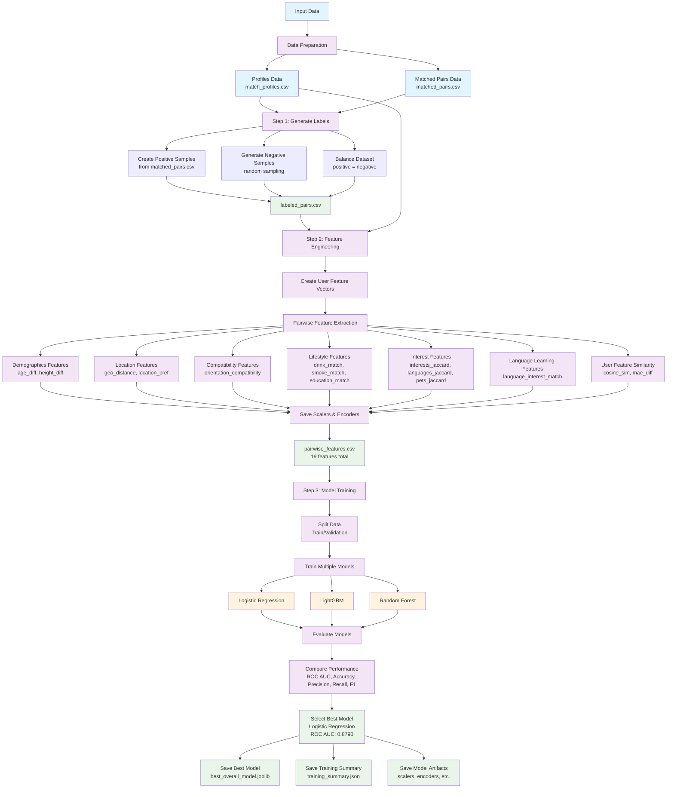

# Sơ Đồ Quy Trình Training Model Matching

## Chi Tiết Các Bước

### 1. Data Preparation
- **Input**: `match_profiles.csv` (thông tin users) + `matched_pairs.csv` (cặp đã match)
- **Output**: Dữ liệu sạch và chuẩn bị cho training

### 2. Label Generation
- **Positive samples**: Từ `matched_pairs.csv` (label = 1)
- **Negative samples**: Random sampling từ các cặp chưa match (label = 0)
- **Balance**: Cân bằng số lượng positive/negative
- **Output**: `labeled_pairs.csv` với 33,174 cặp

### 3. Feature Engineering
- **User Features**: Tạo feature vectors cho từng user
- **Pairwise Features**: 19 features so sánh giữa 2 users
- **Artifacts**: Lưu scalers, encoders cho inference
- **Output**: `pairwise_features.csv` + artifacts trong `models/`

### 4. Model Training
- **Split**: Chia data thành train/validation sets
- **Train**: 3 models (Logistic Regression, LightGBM, Random Forest)
- **Evaluate**: So sánh performance metrics
- **Select**: Chọn Logistic Regression (best ROC AUC: 0.8790)

### 5. Model Persistence
- **Best Model**: Lưu `best_overall_model.joblib`
- **Summary**: Lưu `training_summary.json`
- **Artifacts**: Lưu tất cả scalers, encoders cần thiết

## Performance Comparison

| Model | ROC AUC | Accuracy | Precision | Recall | F1-Score |
|-------|---------|----------|-----------|--------|----------|
| **Logistic Regression** | **0.8790** | 86.15% | 78.33% | 99.94% | 87.83% |
| **LightGBM** | 0.8779 | 86.13% | 78.34% | 99.88% | 87.81% |
| **Random Forest** | 0.8708 | 86.15% | 78.33% | 99.94% | 87.83% |

## Key Features (19 total)

1. **Demographics**: age_diff, height_diff
2. **Location**: geo_distance_km, user1_within_user2_loc_pref, user2_within_user1_loc_pref
3. **Compatibility**: orientation_compatible_user1_to_user2, orientation_compatible_user2_to_user1, orientation_compatible_final
4. **Lifestyle**: drink_match, smoke_match, education_match
5. **Interests**: interests_jaccard, languages_jaccard, pets_jaccard
6. **Language Learning**: user1_wants_learn_lang, user2_wants_learn_lang, language_interest_match
7. **User Features**: user_features_cosine_sim, user_features_mae_diff 